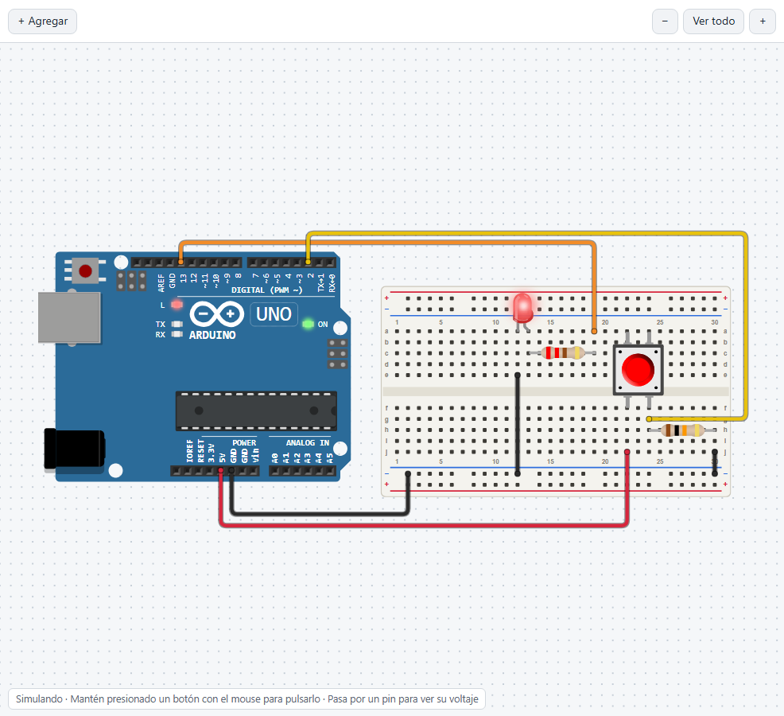
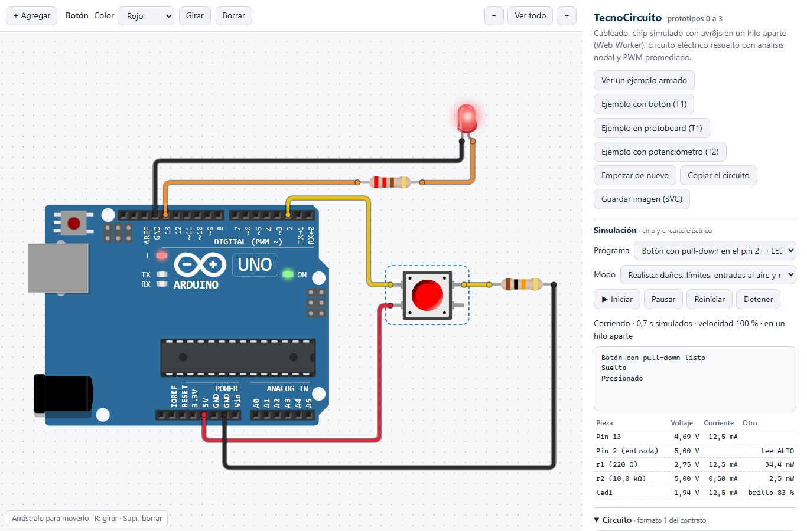
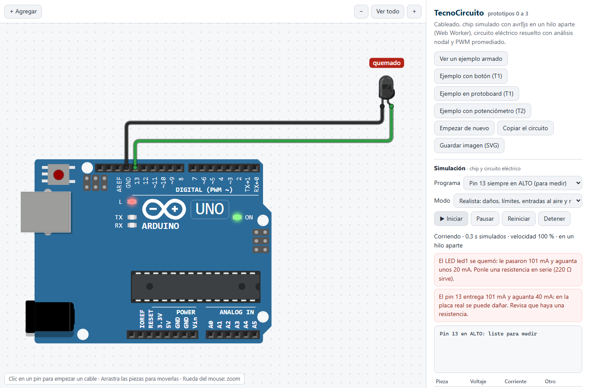

# TecnoCircuito

**Simulador de circuitos con microcontrolador** para [TecnoBloques](https://github.com/EMariotte/TecnoBloques), el editor de bloques en español para Arduino de la TecnoAcademia Tolima (SENA). El aprendiz arma el circuito en una protoboard dibujada, TecnoBloques compila su programa y TecnoCircuito lo ejecuta sobre ese circuito, mostrando también las fallas reales: un LED que se quema, un pin con demasiada corriente, una entrada que lee al azar.



## Qué hace hoy

- **El programa real:** [avr8js](https://github.com/wokwi/avr8js) ejecuta el `.hex` que compila arduino-cli, instrucción por instrucción, con `delay()`, `millis()`, PWM, `analogRead()` y el monitor serial. Corre en un Web Worker, aparte de la página.
- **El circuito real:** un solucionador eléctrico propio (análisis nodal modificado con Newton-Raphson) calcula voltajes y corrientes. Quedó validado con el multímetro contra la placa: 12 de 12 medidas dentro del criterio.
- **Las fallas, y un modo ideal que las apaga:**
  - LED quemado y pin que se pasa de su límite;
  - entrada al aire que lee al azar;
  - ruido en `analogRead()`.
- **Piezas:** Arduino Uno, LED, resistencia, potenciómetro, botón y una media protoboard de 400 puntos en la que las piezas se encajan solas.
- **Para documentar:** el circuito se guarda como imagen SVG, para un proyecto o una evidencia.

| Botón con pull-down (tarea T1) | LED sin resistencia: se quema |
|---|---|
|  |  |

## Estado

Es un **prototipo**: demostró la viabilidad técnica del simulador y ya funciona dentro de TecnoBloques en modo de desarrollo. Las tareas T1 (LED y botón) y T2 (potenciómetro y brillo) están completas. La T3 (motor y servo con la shield L293D) viene después.

## Probarlo

Abre `prototipo/dist/prototipo.html` en el navegador. Es un solo archivo y funciona sin internet. Para reconstruirlo y correr las pruebas:

```
cd prototipo
npm install
npm run construir
npm run probar      # motor y núcleo con Node, y ocho pruebas en Chromium (Python + Playwright)
```

## Cómo nació

La idea era validar con prototipos antes de crear el repositorio. El proyecto creció rápido: en un solo día (7 de octubre de 2026) pasó del cableado de un LED al chip simulado, al circuito eléctrico, al Web Worker con PWM, a las tareas T1 y T2 y a la protoboard. Al final se publicó con su historia:

- [BITACORA.md](BITACORA.md): la historia completa, paso a paso;
- [prototipo/COMO-FUNCIONA.md](prototipo/COMO-FUNCIONA.md): cómo está hecho, con diagramas;
- [prototipo/RECETA-COMPONENTE-NUEVO.md](prototipo/RECETA-COMPONENTE-NUEVO.md): cómo crear un componente que no trae ningún simulador;
- [CONTRATO.md](CONTRATO.md): cómo se hablan TecnoCircuito y TecnoBloques.

## Licencia

Apache 2.0 (ver [LICENSE](LICENSE) y [NOTICE](NOTICE)). Incluye avr8js y @wokwi/elements (MIT) y Lit (BSD-3-Clause).

- **Piezas Tecno:** las piezas hechas para TecnoCircuito, como la protoboard, tienen dibujos originales y también son Apache 2.0. Para crear las tuyas, sigue la [receta](prototipo/RECETA-COMPONENTE-NUEVO.md).
- **Tus imágenes son tuyas:** las imágenes que produce TecnoCircuito (por ejemplo, el SVG de un circuito) son de quien las hace. Se pueden usar, compartir y publicar libremente, sin incluir la licencia ni el aviso.

Hecho en la TecnoAcademia Tolima (SENA, Ibagué) por Efraín Guillermo Mariotte Parra, con Claude.
