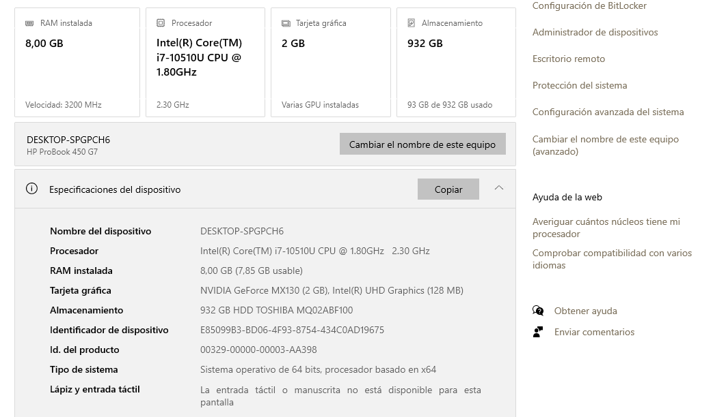
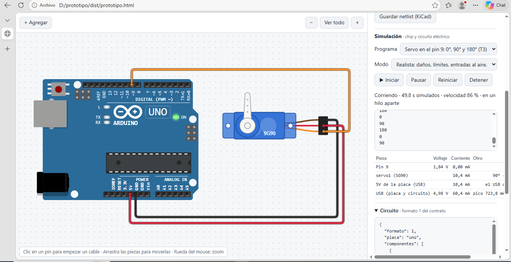
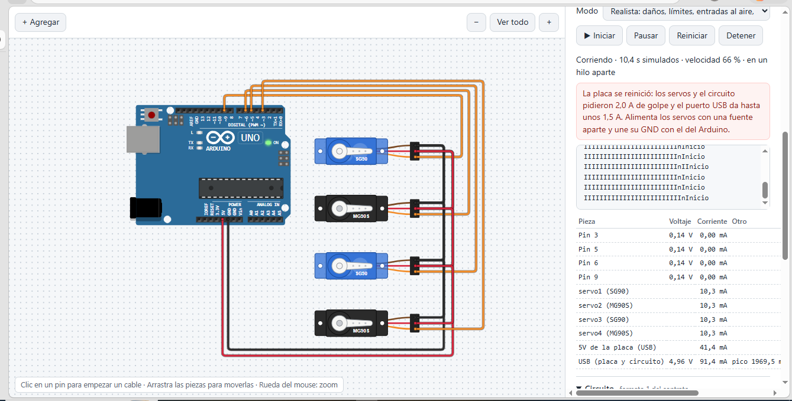

# Velocidad del simulador en un PC del aula

- **Fecha:** 9 de octubre de 2026, en la TecnoAcademia Tolima.
- **Quién:** Efraín Mariotte (medida) y Claude (registro).
- **Qué se probó:** `prototipo/dist/prototipo.html` (TecnoCircuito con el commit `cdb7b7c`), abierto desde una memoria USB (`D:\prototipo\dist\prototipo.html`) en el navegador del PC. Es el mismo motor que usa TecnoBloques: el chip y el circuito corren en un Web Worker.
- **Meta:** velocidad de 90 % o más, estable (CLAUDE.md, «Próxima sesión», punto 3).

## El equipo (todos los PC del aula son iguales)

| | |
|---|---|
| Modelo | HP ProBook 450 G7 |
| Procesador | Intel Core i7-10510U @ 1,80 GHz (2,30 GHz) |
| RAM | 8 GB, 3200 MHz (7,85 GB utilizables) |
| Gráficos | NVIDIA GeForce MX130 (2 GB) e Intel UHD Graphics |
| Disco | HDD Toshiba MQ02ABF100 de 932 GB |
| Sistema | Windows de 64 bits |

## Resultados

| Ejemplo | Velocidad observada | ¿En un hilo aparte? | Nota |
|---|---|---|---|
| «Ejemplo con servo (T3)»: un SG90 en el pin 9 con `servo_barrido` | **Nunca bajó de 90 %** (la captura muestra 86 % en el instante de tomarla) | Sí | Cumple la meta |
| «Cuatro servos en el USB (T3)» con `servos_cuatro`, modo realista | 66 % en la captura | Sí | Caso especial: la placa se reinicia unas 3 veces por segundo y cada reinicio crea un chip nuevo |

**Veredicto:** cumple la meta en el uso normal. El reinicio en bucle por la energía del USB baja la velocidad, pero es una situación de falla que el aprendiz debe corregir.

## Hallazgos en las capturas

1. **El monitor serial muestra «IIIIIII…Inicio»** con los cuatro servos: la placa se reinicia mientras envía «Inicio» y solo alcanza a salir la primera letra. Es coherente con lo que pasa en la placa real, y se compara en la validación de la energía del USB.
2. **La tabla muestra «Pin 9: 1,84 V»** con el servo. Un multímetro mostraría unos 0,3 a 0,6 V: un pulso de 0,5 a 2,4 ms cada 20 ms. El promedio de la tabla falla cuando el período de la señal (20 ms) es más largo que cada foto (16 ms). No afecta al servo, que lee el ancho del pulso directamente. **Pendiente de arreglar.**

## Pendiente

- Medir la velocidad **con TecnoBloques** en un PC del aula. Hoy no se puede: el instalador del aula no trae el simulador hasta que exista la etiqueta `v0.1.0`.
- Confirmar si el PC estaba conectado al cargador (con batería, Windows baja la velocidad del procesador).
